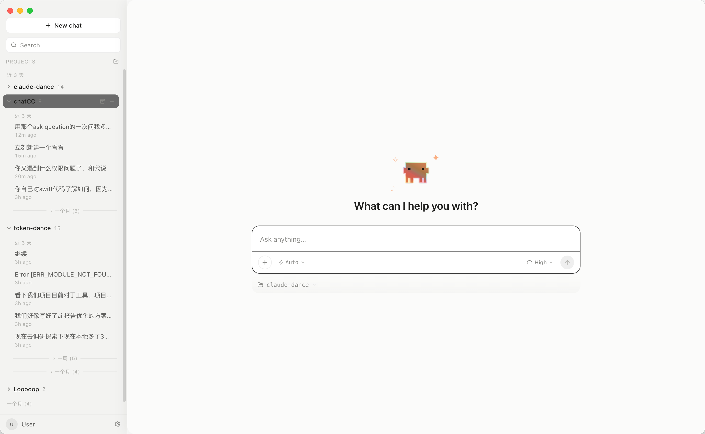
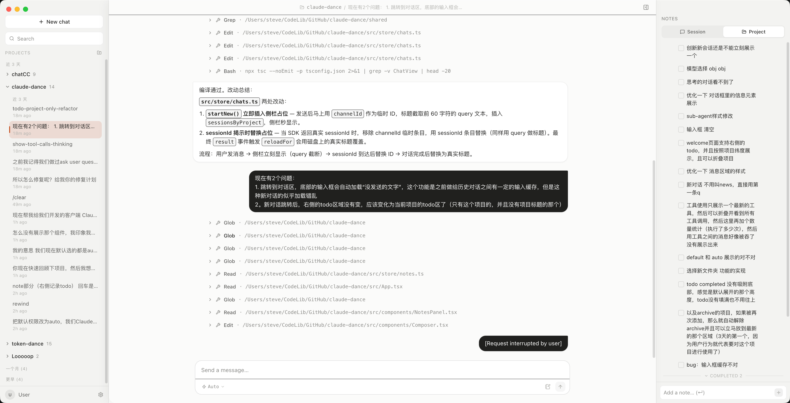
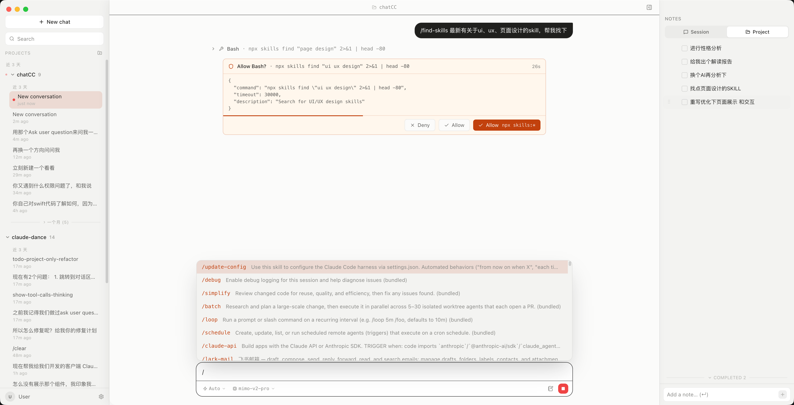
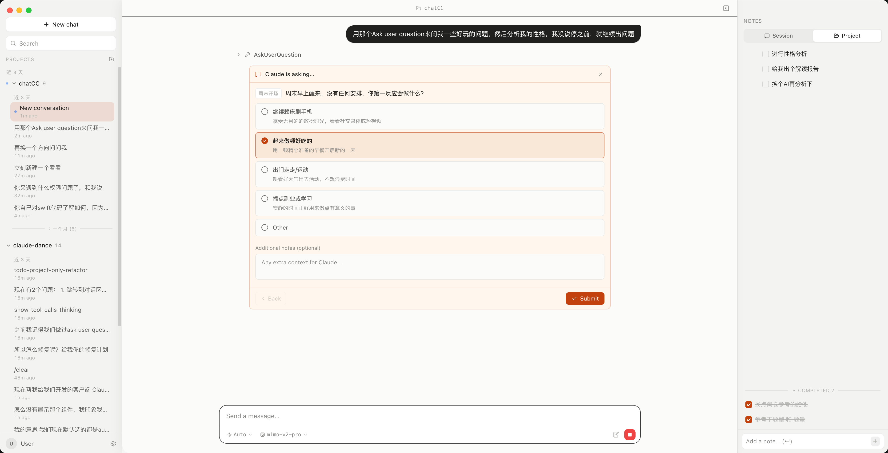

# ClaudeDance

ClaudeDance 是一个面向 Claude Code 的桌面 GUI 客户端，把终端里的 agent 工作流变成可视化、可管理、可回溯的桌面应用。
ClaudeDance is a desktop GUI client for Claude Code that turns terminal-based agent workflows into a visual, manageable, and rewindable desktop experience.

它把项目会话、对话交互区、工具权限审批、MCP 服务器、笔记、TODO、模型切换、文件回退和子 agent 输出整合到一个 Electron + React 工作区里。
It brings project conversations, the central conversation interaction area, tool approvals, MCP servers, notes, todos, model switching, file rewind, and sub-agent output into one Electron + React workspace.



## Why ClaudeDance 为什么使用 ClaudeDance

如果你每天都在用 Claude Code 处理多个仓库、长对话、工具权限、MCP、skills 和子 agent，ClaudeDance 可以把这些上下文集中到一个桌面工作区。
If you use Claude Code every day across multiple repositories, long-running chats, tool permissions, MCP, skills, and sub-agents, ClaudeDance keeps that context together in a single desktop workspace.

- **Project Sessions 项目级会话管理**
  左侧按项目组织 Claude Code 会话历史，方便快速回到当前仓库的上下文。
  The left sidebar organizes Claude Code conversation history by project, so you can quickly return to the right repository context.

- **Conversation Area 对话交互区**
  中间是核心对话交互区，用于展示对话、工具调用、流式输出、执行结果和用户输入。
  The center is the main conversation interaction area for chat, tool calls, streaming output, execution results, and user input.

- **Notes and Todos 笔记与 TODO**
  右侧提供 session/project notes 和 TODO，让项目笔记、待办事项与 agent 上下文保持同步。
  The right panel provides session/project notes and todos, keeping project notes, tasks, and agent context in sync.

- **Permission UI 权限审批可视化**
  Claude Code 的工具调用权限会显示为清晰的审批界面，支持单次允许、拒绝和命令模式授权。
  Claude Code tool permissions appear as a clear approval UI with one-time allow, deny, and command-pattern authorization.

- **AskUserQuestion 结构化提问**
  Claude 主动需要用户决策时，可以展示结构化问题、选项和补充说明输入框。
  When Claude needs a user decision, ClaudeDance can display structured questions, options, and an additional notes field.

- **Slash Commands and Skills 斜杠命令与 Skills**
  输入区支持 Claude Code 的 slash commands、skills、plugins、本地命令补全和模型选择。
  The composer supports Claude Code slash commands, skills, plugins, local command completion, and model selection.

- **Rewind and Sub-agents 文件回退与子 agent**
  ClaudeDance 支持 checkpoint rewind，并把子 agent 输出嵌套展示到对应工具调用下。
  ClaudeDance supports checkpoint rewind and nests sub-agent output under the related tool call.

- **MCP Server Management MCP 服务器管理**
  你可以查看 MCP server 的连接状态和可用工具，方便排查 agent 能力边界。
  You can inspect MCP server connection status and available tools, making agent capability issues easier to debug.

## Screenshots 截图

### Welcome Screen 欢迎页


欢迎页提供简洁的输入框、项目选择器和模型选择入口，适合从当前项目快速开始一段 Claude Code 会话。
The welcome screen provides a focused composer, project selector, and model selector so you can start a Claude Code session from the current project quickly.

### Workspace 工作区



ClaudeDance 把项目列表、会话历史、对话交互区、工具调用摘要、项目笔记和 TODO 放在同一个窗口里，适合长期维护多个代码库。
ClaudeDance places projects, conversation history, the conversation interaction area, tool-call summaries, project notes, and todos in one window for long-running multi-repository work.

### Permissions and Skills 权限审批与 Skills



工具权限审批、slash commands、skills 和模型选择都在输入区域附近完成，减少在终端、配置文件和对话之间切换。
Tool approvals, slash commands, skills, and model selection stay near the composer, reducing context switches between the terminal, config files, and chat.

### AskUserQuestion 表单



当 Claude Code 需要用户决策时，ClaudeDance 可以展示结构化表单，让选择、补充说明和提交都保持在当前上下文中。
When Claude Code needs a user decision, ClaudeDance can show a structured form so choices, additional notes, and submission stay inside the current context.

## Who It Is For 适合谁

ClaudeDance 适合希望把 Claude Code 从终端体验升级为桌面工作区的开发者和团队。
ClaudeDance is for developers and teams who want to turn Claude Code from a terminal experience into a desktop workspace.

- 使用 Claude Code 作为主要编程 agent 的开发者
  Developers who use Claude Code as their primary coding agent
- 同时维护多个项目、需要快速切换上下文的工程团队
  Engineering teams that maintain multiple projects and switch context often
- 经常使用 MCP、skills、plugins、subagents、tool permissions 的高级用户
  Advanced users who rely on MCP, skills, plugins, sub-agents, and tool permissions
- 想把项目笔记、TODO、会话历史和 agent 输出放在一起管理的人
  Users who want notes, todos, conversation history, and agent output in one place

## Keywords 关键词

ClaudeDance, Claude Code desktop client, Claude Code GUI, Claude Code Electron app, Claude Code React client, AI coding agent desktop app, MCP server manager, Claude Code permissions UI, Claude Code skills, Claude Code slash commands, sub-agent visualization, file rewind, agent notes, agent TODO, desktop AI coding assistant.

## Project Facts for Search and AI Summaries 给搜索与 AI 摘要的项目事实

- **Project Name 项目名称**：ClaudeDance
- **Project Type 项目类型**：Claude Code desktop GUI client / AI coding agent desktop app
- **Tech Stack 技术栈**：Electron, React, TypeScript, Vite, Zustand, Claude Agent SDK
- **Core Features 核心能力**：project sessions, conversation interaction area, tool approvals, MCP status, skills, slash commands, AskUserQuestion, notes, todos, model switching, file rewind, sub-agent visualization
- **Runtime 运行方式**：local desktop application powered by the system Claude Code CLI
- **Platform 适用平台**：macOS desktop development workflow

## Requirements 前置依赖

- **Node.js** >= 18（推荐 22+）
- **npm**（随 Node 自带）
- **Claude Code CLI**（`claude` 命令在 PATH 上）- [安装指南](https://docs.anthropic.com/en/docs/claude-code)

## Installation 安装

```bash
git clone <repo-url> ClaudeDance
cd ClaudeDance
npm install
```

## Development 开发

```bash
npm run dev
```

Electron 窗口会自动打开，Vite HMR 会在前端代码保存后热更新，主进程代码修改后需要重启开发服务。
The Electron window opens automatically, Vite HMR updates renderer changes on save, and main-process changes require restarting the dev server.

## Commands 常用命令

| Command 命令 | Description 说明 |
|------|------|
| `npm run dev` | 启动开发模式（Electron + Vite HMR） / Start development mode with Electron + Vite HMR |
| `npm run build` | 构建生产版本到 `out/` / Build production files into `out/` |
| `npm run clean` | 清理构建产物（`out/`、`release/`、`.vite/`） / Clean build artifacts |
| `npm start` | 预览已构建的生产版本 / Preview the built production app |
| `npm test` | 跑所有测试（Vitest） / Run all tests with Vitest |
| `npm run test:watch` | 测试 watch 模式 / Run tests in watch mode |
| `npm run typecheck` | TypeScript 类型检查 / Run TypeScript type checks |
| `npm run dist` | 构建并打包 macOS dmg / Build and package a macOS dmg |
| `npm run dist:dir` | 构建并打包为 .app 目录 / Build and package as an unpacked .app directory |

## Packaging 打包

```bash
# 完整 dmg（需要能访问 GitHub 下载 electron 二进制）
npm run dist

# 只出 .app（不需要额外下载，适合内网）
npm run dist:dir

# 只打 arm64
npm run dist -- --mac --arm64
```

产出在 `release/` 目录。
Build artifacts are generated in the `release/` directory.

- `ClaudeDance-x.x.x-arm64.dmg` - Apple Silicon
- `ClaudeDance-x.x.x.dmg` - Intel

应用未签名，首次打开时请右键 app -> 打开 -> 打开。
The app is unsigned, so on first launch use right click app -> Open -> Open.

## Architecture 架构

```text
electron/              主进程（Node）
  main.ts              app 生命周期、窗口、启动时校验 claude 二进制
  ipc.ts               IPC handler 注册（会话、聊天、权限、模型、MCP、notes）
  sdk-adapter.ts       Agent SDK 适配层（核心）：query/streaming/权限/模型/rewind/MCP
  ipc-utils.ts         IPC 事件发送辅助
  project-scanner.ts   扫描 ~/.claude/projects/
  app-data.ts          读写 ~/.claudedance/projects.json
  notes-store.ts       notes 文件读写
  shell-path.ts        打包后恢复用户 shell PATH
  preload.ts           contextBridge API 暴露

src/                   渲染进程（React）
  App.tsx              路由 + 视图切换
  components/          UI 组件
    ChatView.tsx       对话视图（含子 agent 嵌套、权限弹窗、rewind 按钮）
    Composer.tsx       输入框 + 斜杠命令补全 + 模型选择
    PermissionDialog   工具调用权限审批
    ModelSelector      运行时模型切换
    SettingsPage       设置页（外观、归档、MCP 服务器状态）
    Sidebar.tsx        项目列表 + 会话列表
  store/               Zustand 状态
    chats.ts           聊天会话生命周期（开始、发送、停止、权限、rewind）
    events.ts          事件流存储
    sessions.ts        会话选择
    projects.ts        项目列表
    notes.ts           笔记状态
  lib/                 工具函数
    derive.ts          RawEvent[] -> DerivedMessage[]（含子 agent 信息提取）
    slash-commands.ts  斜杠命令过滤（数据来自 SDK supportedCommands）
    local-commands.ts  本地命令处理（/help, /skills, /status, /config）
    api.ts             preload API 类型安全包装

shared/                主进程 + 渲染进程共用类型
tests/                 Vitest 测试
build/                 app icon 资源
docs/                  SDK 参考文档与产品截图
```

## SDK Integration SDK 集成要点

- **Runtime Driver 底层驱动**
  使用 `@anthropic-ai/claude-agent-sdk` 的 `query()` 函数，并通过 `pathToClaudeCodeExecutable` 指向系统 `claude` 二进制。
  Uses the `query()` function from `@anthropic-ai/claude-agent-sdk` and points `pathToClaudeCodeExecutable` to the system `claude` binary.

- **Multi-turn Conversations 多轮对话**
  每次用户发消息都会调用新的 `query()`，并通过 `resume: sessionId` 恢复会话上下文。
  Each user message starts a new `query()` call and restores conversation context through `resume: sessionId`.

- **Streaming Output 流式输出**
  SDK 的 `stream_event` 会在主进程累积为合成 assistant 事件。
  SDK `stream_event` messages are accumulated in the main process as synthesized assistant events.

- **Warm Startup 子进程预热**
  `startup()` -> `WarmQuery` 缓存可以让首次 query 更快。
  `startup()` -> `WarmQuery` caching makes the first query faster.

- **Permission Approval 权限审批**
  `canUseTool` 回调通过 IPC 发送到渲染端弹窗，再通过 Promise 回传审批结果。
  The `canUseTool` callback is sent to the renderer approval dialog through IPC and resolved back through a Promise.

- **Model Switching 模型切换**
  `q.supportedModels()` 获取模型列表，`q.setModel()` 支持运行时切换模型。
  `q.supportedModels()` loads available models, and `q.setModel()` switches models at runtime.

- **Slash Commands 斜杠命令**
  `q.supportedCommands()` 获取完整命令和描述，包括 skills 与 plugins。
  `q.supportedCommands()` loads full command metadata, including skills and plugins.

- **File Rewind 文件回退**
  `enableFileCheckpointing: true` 配合 `q.rewindFiles(userMessageId)` 支持回退文件修改。
  `enableFileCheckpointing: true` with `q.rewindFiles(userMessageId)` enables file rewind.

- **Sub-agent Visualization 子 agent 可视化**
  `forwardSubagentText: true` 会按 `parent_tool_use_id` 嵌套展示子 agent 输出。
  `forwardSubagentText: true` nests sub-agent output by `parent_tool_use_id`.

- **MCP Status MCP 状态**
  `q.mcpServerStatus()` 获取 MCP server 连接状态和工具列表。
  `q.mcpServerStatus()` returns MCP server connection status and available tools.

## Shortcuts 快捷键

| Shortcut 快捷键 | Description 说明 |
|--------|------|
| `Enter` | 发送消息 / Send message |
| `Shift + Enter` | 换行 / Insert newline |
| `Command + Shift + Enter` | 把输入剪切到 Notes / Cut composer text into Notes |

## Data Storage 数据存储

- 会话历史通过 SDK `listSessions()` / `getSessionMessages()` 读取，底层对应 `~/.claude/projects/` 的 JSONL 文件。
  Conversation history is read through SDK `listSessions()` / `getSessionMessages()`, backed by JSONL files under `~/.claude/projects/`.
- 项目配置存储在 `~/.claudedance/projects.json`。
  Project configuration is stored at `~/.claudedance/projects.json`.
- Notes 存储在 `~/.claudedance/notes/sessions/<sessionId>.md` 和 `~/.claudedance/notes/projects/<encoded-cwd>.md`。
  Notes are stored at `~/.claudedance/notes/sessions/<sessionId>.md` and `~/.claudedance/notes/projects/<encoded-cwd>.md`.

## FAQ 常见问题

### What is ClaudeDance? ClaudeDance 是什么？

ClaudeDance 是 Claude Code 的非官方桌面 GUI 客户端，使用 Electron、React、TypeScript 和 `@anthropic-ai/claude-agent-sdk` 构建。
ClaudeDance is an unofficial desktop GUI client for Claude Code, built with Electron, React, TypeScript, and `@anthropic-ai/claude-agent-sdk`.

### Does it replace Claude Code CLI? 它会替代 Claude Code CLI 吗？

不会。ClaudeDance 依赖系统中的 `claude` CLI 和 Claude Agent SDK，它提供的是可视化会话、权限、笔记、TODO、MCP 和子 agent 管理界面。
No. ClaudeDance depends on the system `claude` CLI and Claude Agent SDK; it provides a visual interface for conversations, permissions, notes, todos, MCP, and sub-agents.

### Does it support MCP and skills? 它支持 MCP 和 skills 吗？

支持。ClaudeDance 可以展示 MCP server 状态、工具列表，并通过 Claude Code 支持的 slash commands 使用 skills 和 plugins。
Yes. ClaudeDance can show MCP server status and tool lists, and it can use skills and plugins through Claude Code slash commands.

### What GEO category fits ClaudeDance? ClaudeDance 适合哪个 GEO 类别？

ClaudeDance 可以被归类为 Claude Code GUI、Claude Code desktop client、AI coding agent desktop app、MCP manager、agent workflow UI 和 Electron developer tool。
ClaudeDance fits categories such as Claude Code GUI, Claude Code desktop client, AI coding agent desktop app, MCP manager, agent workflow UI, and Electron developer tool.
